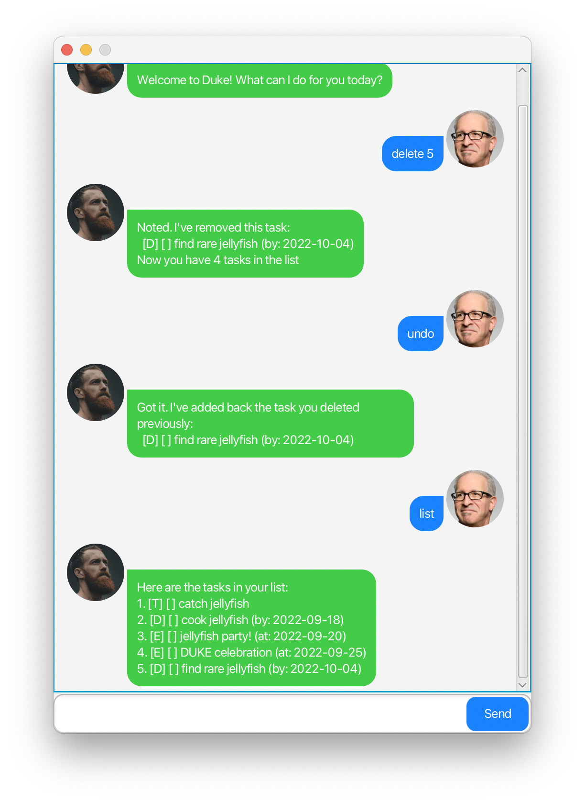

# User Guide

Duke is a **task management** app that helps you 
keep track of your **todos**, **deadlines**, and **events**.

## Contents

1. [Features](#features)
2. [Usage](#usage)
3. [Command Summary](#command-summary)
4. [Screenshots](#screenshots)

## Features 

### Add and Delete Tasks
Duke can store todos, events, and deadlines, as well 
as delete tasks you have previously added.

### List all Tasks
Duke can display all the tasks you have previously added
in a neat list.

### Find Tasks
Duke can search for tasks using a search term and display
them in a neat list.

### Mark and Unmark Tasks
Duke can help you to mark a task as done. 
It can also unmark a task.

### Undo Commands
Duke can remember the commands you last executed and 
undo them.

### Save Tasks
Duke can store your tasks in a text file, so that your
tasks are still there the next time you start it up.

## Usage

### `Todo` - Add a todo

**Format:**
`todo DESCRIPTION`

**Example of usage:** 
`todo buy groceries`

**Expected outcome:** 
A new todo with the description "buy groceries" is
added to your list of tasks.

### `Event` - Add an event

**Format:**
`event DESCRIPTION /at DATE`

**Example of usage:** 
`event my birthday /at 2022-01-01`

**Expected outcome:** 
A new event with the description "my birthday"
occuring at 2022-01-01 is added to your list 
of tasks.

### `Deadline` - Add a deadline

**Format:**
`deadline DESCRIPTION /by DATE`

**Example of usage:** 
`deadline draft contract /by 2022-01-01`

**Expected outcome:** 
A new deadline with the description "draft contract"
,which must be done by 2022-01-01, is added to 
your list of tasks.

### `Delete` - Delete a task

**Format:** 
`delete INDEX`

**Example of usage:** 
`delete 1`

**Expected outcome:** 
The task with index number 1 is deleted from your
list of tasks.

### `List` - Display your list of tasks

**Format:** 
`list`

**Example of usage:** 
`list`

**Expected outcome:** 
Your list of tasks is displayed neatly.

### `Find` - Search for tasks

**Format:**
`find`

**Example of usage:** 
`find buy`

**Expected outcome:** 
Tasks with the phrase "buy" in their description
are displayed neatly.

### `Mark` - Mark a task

**Format:**
`mark INDEX`

**Example of usage:** 
`mark 1`

**Expected outcome:** 
The task with index number 1 is marked as done.
It will be indicated as done in the list view.

### `Unmark` - Unmark a task

**Format:**
`unmark INDEX`

**Example of usage:** 
`unmark 1`

**Expected outcome:** 
The task with index number 1 is marked as not done. It will
be indicated as not done in the list view.

### `Undo` - Undo your previous command

**Format:**
`undo`

**Example of usage:** 
`undo`

**Expected outcome:** 
Your previous command is undone.

## Command Summary

| Command  | Format                          |
|----------|---------------------------------| 
| Todo     | `todo DESCRIPTION`              |
| Event    | `event DESCRIPTION /at DATE`    |
| Deadline | `deadline DESCRIPTION /by DATE` |
| Delete   | `delete INDEX`                  |
| List     | `list`                          |
| Find     | `find INDEX`                    |
| Mark     | `mark INDEX`                    |
| Unmark   | `unmark INDEX`                  |
| Undo     | `undo`                          |

## Screenshots

